# Supporting Materials — Diagrams & User Flows

> **Purpose:** Visual artefacts to lift directly into the final presentation deck.
> Covers both options side-by-side: **Option A** (targeted onboarding hotfix, [PLAN.md](./PLAN.md)) and **Option B** (AI course creator, [PLAN-OPTION-02.md](./PLAN-OPTION-02.md)).
> Diagrams use **Mermaid** (renders in Marp, GitHub, Notion, and most slide tools) and **ASCII** ribbons (consistent with [FLOW.md](./FLOW.md) for inline use).

---

## 1. The persona at a glance

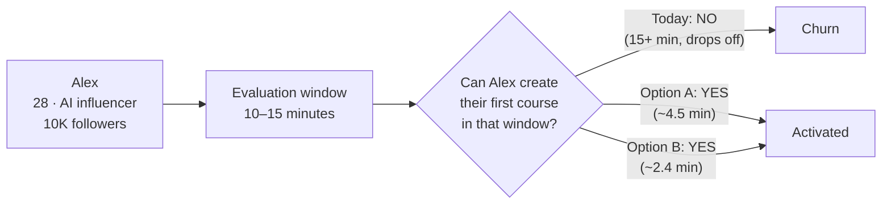

**The metric:** time-to-first-draft-course, measured from `signup_completed` to `product_created`/`outline_accepted` in `onboarding_events`.

---

## 2. Current ablefy — the problem state

### 2.1 Today's flow (the baseline we're fixing)

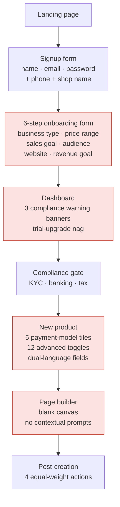

**Red blocks = friction concentrations** (the audit's five blockers).

### 2.2 The five blockers mapped to fixes

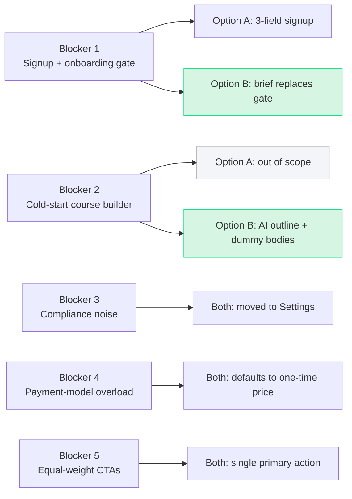

---

## 3. Option A — Targeted onboarding hotfix

### 3.1 User flow (ASCII ribbon, matches FLOW.md)

```
┌──────────────────────────────────────────────────────────────────────┐
│  /signup           /welcome            /dashboard                    │
│  ┌──────────┐     ┌──────────┐        ┌──────────┐                   │
│  │ Name     │ ──► │ Hi Alex! │ ─────► │  Create  │                   │
│  │ Email    │     │ Skip ▶   │        │  your    │                   │
│  │ Password │     └──────────┘        │  first   │                   │
│  └──────────┘      10 sec              │  product │                   │
│   30 sec                               └──────────┘                   │
│                                          20 sec                       │
│                                            │                          │
│                                            ▼                          │
│  /products/:id/created     /products/new                              │
│  ┌──────────┐              ┌──────────┐                               │
│  │ ✓ Course │ ◄──────────  │ Title    │                               │
│  │   ready! │              │ Desc     │                               │
│  │ [Add     │              │ Image    │                               │
│  │  Content]│              │ Price €  │                               │
│  │ More ▾   │              └──────────┘                               │
│  └──────────┘                90 sec                                   │
│   30 sec                                                              │
│                                                                       │
│  Total target: under 5 minutes                                        │
└──────────────────────────────────────────────────────────────────────┘
```

### 3.2 User flow (Mermaid for the deck)

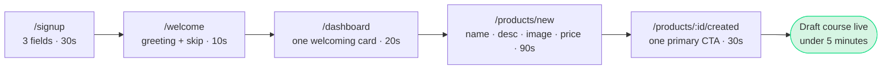

### 3.3 Decision tree at `/welcome`

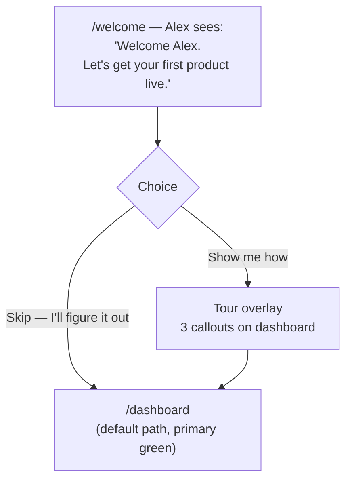

### 3.4 What got removed

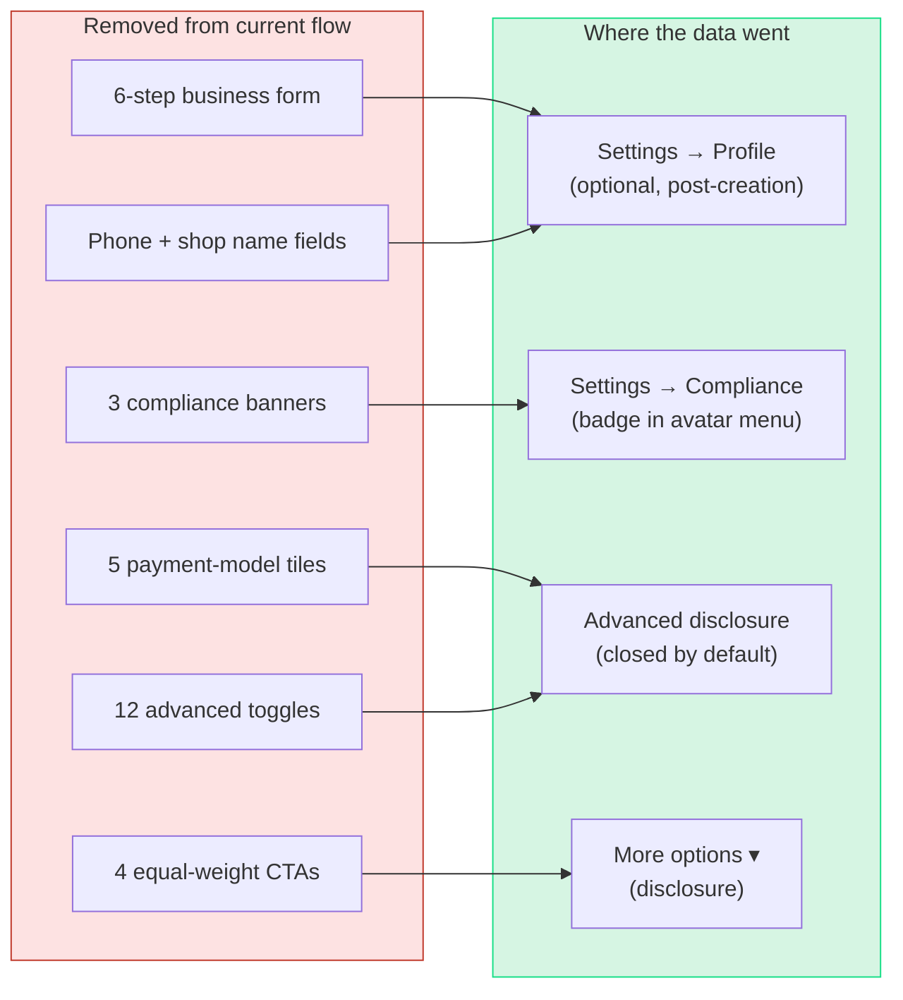

### 3.5 Time-to-value breakdown

```mermaid
gantt
  title Option A — Time-to-value (target: under 5 min)
  dateFormat  ss
  axisFormat  %S s

  section Signup
  3 fields                  :a1, 0, 30s
  section Welcome
  Greeting + skip           :a2, after a1, 10s
  section Dashboard
  Orient + click create     :a3, after a2, 20s
  section Product
  Name · desc · image · €   :a4, after a3, 90s
  section Created
  Read + add content        :a5, after a4, 30s
```

---

## 4. Option B — AI course creator

### 4.1 User flow (ASCII ribbon)

```
┌──────────────────────────────────────────────────────────────────────┐
│  /signup           /dashboard            /products/new/ai            │
│  ┌──────────┐     ┌──────────┐          ┌──────────────────┐         │
│  │ Name     │ ──► │ Create   │ ───────► │ "What do you     │         │
│  │ Email    │     │ with AI  │          │  want to teach?" │         │
│  │ Password │     │ [primary]│          │  ┌────────────┐  │         │
│  └──────────┘     │          │          │  │ textarea 🎤│  │         │
│   30 sec          │ Manual   │          │  └────────────┘  │         │
│                   │ [link]   │          │   Generate       │         │
│                   └──────────┘          └──────────────────┘         │
│                    10 sec                 20 sec (typing)            │
│                                                  │                   │
│                                                  ▼                   │
│  /products/:id/    /products/:id/        Outline editor              │
│  content           created               ┌────────────────────────┐  │
│  ┌──────────┐     ┌──────────┐          │ Module 1 ▾  [↻] [×]    │  │
│  │ Module 1 │ ◄── │ ✓ Course │ ◄─────── │   • Lesson 1.1  [edit] │  │
│  │ • Body   │     │   ready! │          │   • Lesson 1.2  [edit] │  │
│  │ Module 2 │     │ [Add     │          │ Module 2 ▾  [↻] [×]    │  │
│  │ • Body   │     │  Content]│          │   …                    │  │
│  │ "Edit -  │     │ More ▾   │          │ [Looks good] [Restart] │  │
│  │  full v" │     └──────────┘          │              💬 chat   │  │
│  └──────────┘      30 sec                └────────────────────────┘  │
│   60 sec                                  ~60 sec                    │
│                                                                      │
│  Total target: under 3 minutes                                       │
└──────────────────────────────────────────────────────────────────────┘
```

### 4.2 User flow (Mermaid for the deck)

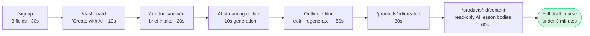

### 4.3 AI generation pipeline (sequence diagram)

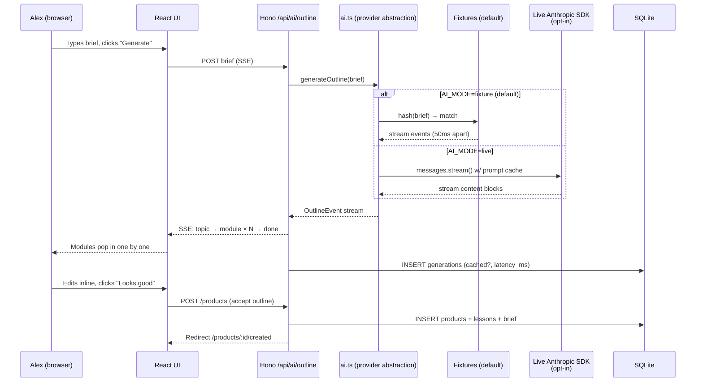

### 4.4 Outline editor — interaction states

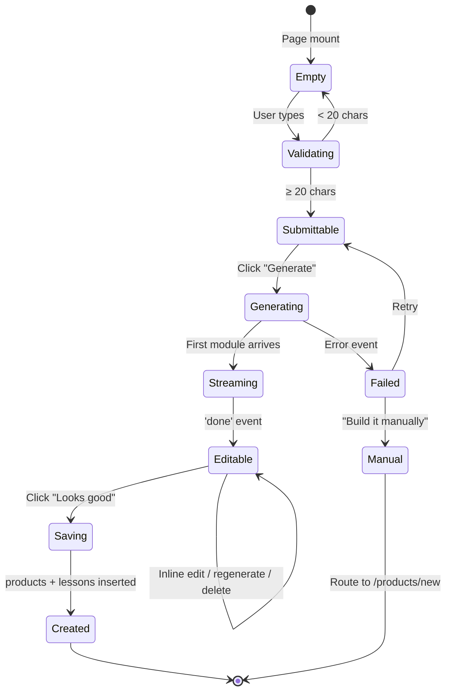

### 4.5 The three "coming in full version" affordances

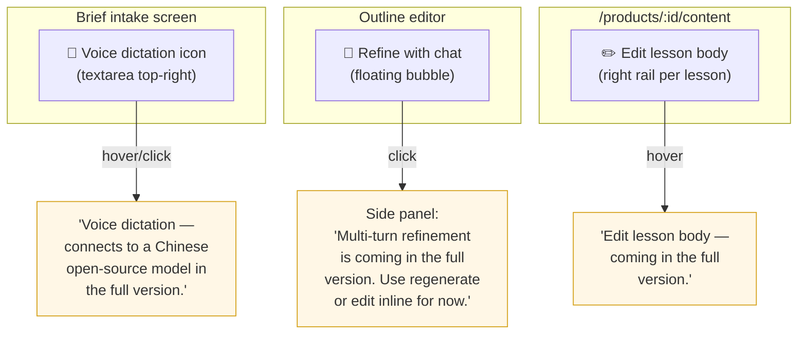

### 4.6 Data model overview (Option A vs Option B)

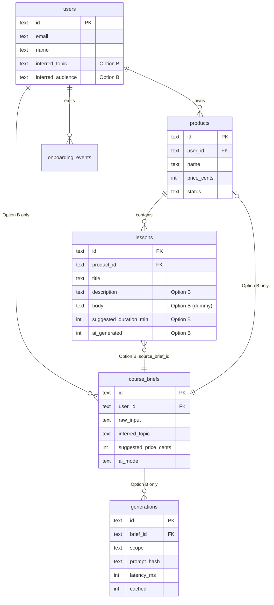

### 4.7 Time-to-value breakdown

```mermaid
gantt
  title Option B — Time-to-value (target: under 3 min)
  dateFormat  ss
  axisFormat  %S s

  section Signup
  3 fields                  :b1, 0, 30s
  section Dashboard
  Click "Create with AI"    :b2, after b1, 10s
  section Brief
  Type 1–3 sentences        :b3, after b2, 20s
  section Generation
  AI streaming outline      :b4, after b3, 10s
  section Editing
  Inline edit + regenerate  :b5, after b4, 50s
  section Created
  Read post-creation        :b6, after b5, 30s
```

---

## 5. Side-by-side comparison

### 5.1 Flow density

```mermaid
flowchart TB
  subgraph Today["Current ablefy · 15+ min"]
    T1["Signup +<br/>phone +<br/>shop name"] --> T2["6-step<br/>business form"] --> T3["Compliance<br/>banners ×3"] --> T4["Compliance<br/>gate"] --> T5["Payment-model<br/>tiles ×5"] --> T6["Page builder<br/>blank canvas"] --> T7["4 equal CTAs"]
  end

  subgraph A["Option A · ~4.5 min"]
    A1["Signup<br/>3 fields"] --> A2["Welcome<br/>+ skip"] --> A3["Dashboard<br/>one CTA"] --> A4["Product form<br/>4 fields + €"] --> A5["Created<br/>1 primary"]
  end

  subgraph B["Option B · ~2.4 min"]
    B1["Signup<br/>3 fields"] --> B2["Dashboard<br/>'Create with AI'"] --> B3["Brief<br/>1–3 sentences"] --> B4["Outline<br/>streaming + edit"] --> B5["Course content<br/>read-only viewer"]
  end

  style Today fill:#fde2e2,stroke:#c0392b
  style A fill:#fff7e6,stroke:#d4a017
  style B fill:#d6f5e3,stroke:#17df87
```

### 5.2 What each option costs and delivers

| Dimension | Today | Option A | Option B |
|---|---|---|---|
| **Time-to-value (target)** | 15+ min | ~4.5 min | ~2.4 min |
| **Steps in flow** | 7 | 5 | 5 |
| **Form fields before first product** | ~25 | 3 | 3 |
| **Decisions before first product** | High | Low | Very low |
| **Build cost (engineering hours)** | — | ~3 hours | ~4.5 hours |
| **Demo risk** | — | Very low | Low (fixture default) |
| **Hiring-signal value** | — | Engineering judgment + design fluency | Adds AI fluency, prompt caching, streaming UX |
| **Persona fit for Alex** | Poor | Good | Excellent |
| **Production readiness** | — | Ship next sprint | Ship next quarter |

### 5.3 Roadmap framing for the deck

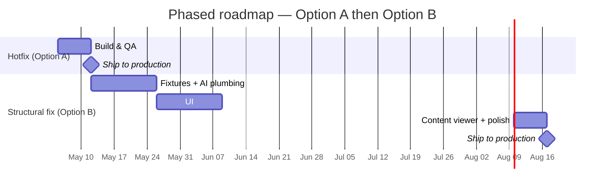

---

## 6. Animation inventory

Both options together introduce **six** subtle, cross-browser animations. All `transform` / `opacity` only. All have `prefers-reduced-motion: reduce` fallbacks.

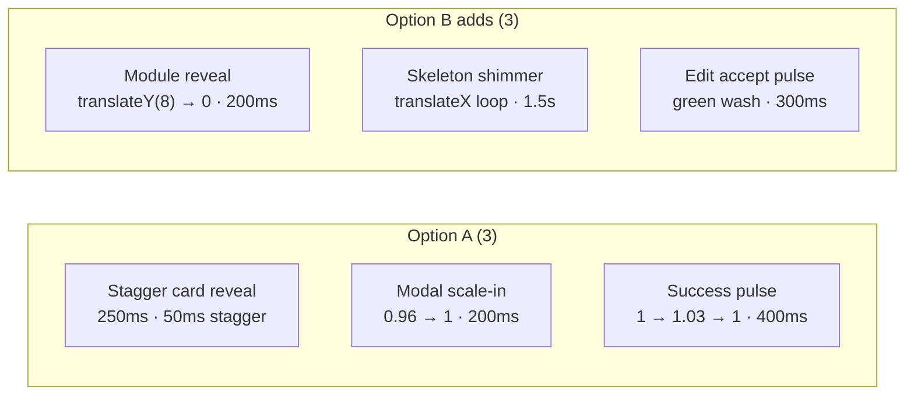

---

## 7. Talk track (one slide per section)

The deck should follow this beat:

1. **The persona** — Alex, 10–15 min window. (Section 1 diagram.)
2. **The problem today** — 15+ minute flow with five blockers. (Section 2.1 + 2.2.)
3. **Option A — the hotfix** — flow ribbon, what got removed, where the data went. (Section 3.1, 3.4.)
4. **Option B — the structural fix** — flow ribbon, AI pipeline, three "full version" affordances. (Section 4.1, 4.3, 4.5.)
5. **Side-by-side** — flow density + cost/delivery table. (Section 5.1, 5.2.)
6. **Roadmap** — A as hotfix next sprint, B next quarter. (Section 5.3.)
7. **Trust + craft** — animation inventory, design-system fidelity, accessibility posture. (Section 6.)
8. **Live demo** — both flows in the prototype, time-to-value metric on `/dev/metrics`.

---

## 8. Asset checklist (for screenshots and the final deck)

| Asset | Source | Status |
|---|---|---|
| Persona card screenshot | Notion audit doc | TODO |
| Today's flow annotated | Manual screenshot of current ablefy + overlay | TODO |
| Option A — `/signup` | Prototype `/signup` | TODO (after Phase 2 of Option A) |
| Option A — `/welcome` | Prototype `/welcome` | TODO (after Phase 3 of Option A) |
| Option A — `/dashboard` | Prototype `/dashboard` | TODO |
| Option A — `/products/new` | Prototype `/products/new` | TODO |
| Option A — `/products/:id/created` | Prototype | TODO |
| Option B — `/products/new/ai` (brief) | Prototype | TODO (after Phase 5 of Option B) |
| Option B — outline streaming | Recorded GIF | TODO |
| Option B — outline edited | Prototype | TODO |
| Option B — `/products/:id/content` | Prototype | TODO |
| Live Haiku 4.5 capture | Recorded with `AI_MODE=live` during prep | TODO |
| `/dev/metrics` time-to-value | Prototype | TODO |

Screenshots live in `prototype/public/screenshots/option-01/` and `prototype/public/screenshots/option-02/`.
